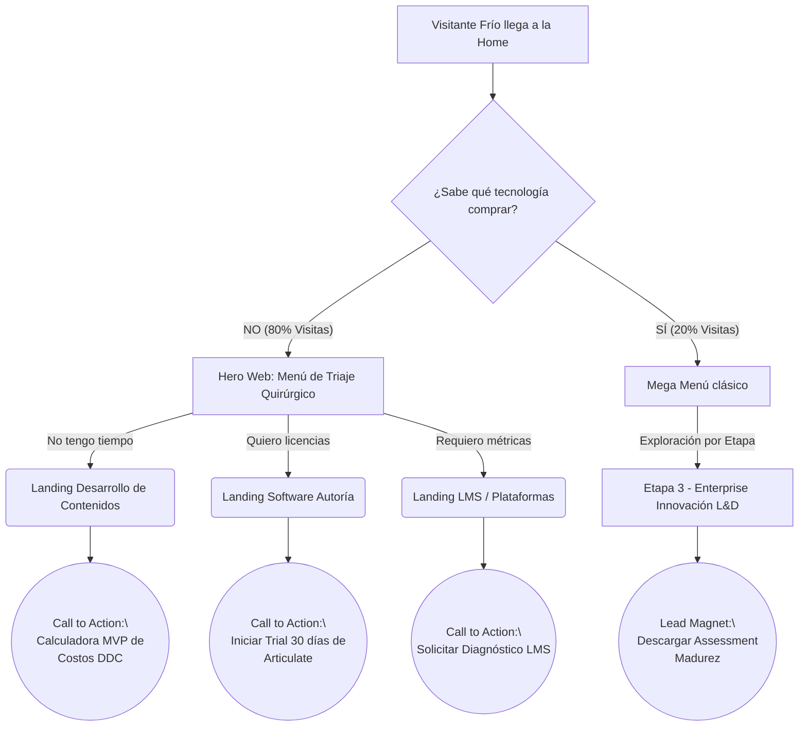

# Wireframes Estructurales UX: TAEC Web Frontend

> **Nota:** Estos wireframes en texto demuestran cómo la filosofía "Solution-Led" cambia por completo la experiencia visual frente a un catálogo común.

---

## 🖼️ Propuesta 1: La Home Page como "Triaje Quirúrgico"
*El usuario entra al sitio y no ve productos fríos (como "Moodle" o "Articulate"). Ve soluciones inmediatas enfocadas en sus frustraciones corporativas.*

### [Wireframe Visual - Hero Banner Principal]

```text
===================================================================================
[ TAEC LOGO ]               Navegación Híbrida                          [ Contactar ]
===================================================================================


                 ¿QUÉ GRAN RETO NECESITAS RESOLVER ESTE AÑO?                
           "No te vendemos licencias, te resolvemos la operación de L&D."           

   +--------------------------+  +--------------------------+  +------------------+
   |  🛠️ QUIERO CREAR        |  |  ✍️ NO TENGO TIEMPO      |  |  📊 NECESITO     |
   |  MIS PROPIOS CURSOS      |  |  PARA PRODUCIR NADA      |  |  UNA PLATAFORMA  |
   |--------------------------|  |--------------------------|  |------------------|
   |  "Necesito herramientas  |  |  "Ustedes desarrollan    |  |  "Control, metas |
   |  veloces e instintivas"  |  |  el contenido por mi"    |  |  y certificados" |
   |                          |  |                          |  |                  |
   |   [ Ver Herramientas ]   |  |  [ Cotizar mi Proyecto]  |  |   [ Ver LMS ]    |
   |    (Articulate/Vyond)    |  |   (Calculadora DDC MVP)  |  |  (Totara/Moodle) |
   +--------------------------+  +--------------------------+  +------------------+

                       👉 ¿Tus cursos son muy aburridos?                        
                 [Ver Soluciones de Inmersión e Inteligencia Artificial]                     
===================================================================================
```

---

## 🖼️ Propuesta 2: El Megamenú "Viaje de Madurez B2B"
*El "Mega Menú" (Nav) que acompaña al usuario en toda la web. En lugar de llamarse "Productos" o "Servicios", se fusiona con la ruta A+C (Dolor + Madurez).*

### [Wireframe Visual - Header Navigation]

```text
[ LOGO ]   |   🎯 Resolviendo mi problema   |   🧭 Planificando mi Equipo   |   [ Blog ]  

▼ Hover en "🎯 Resolviendo mi problema" (Ruta Clínica Directa / Dolor)
+----------------------------------------------------------------------------------------+
|  🛠️ Producir Contenido         Licencias Articulate 360  ·  Licencias Vyond IA         |
|  ✍️ Tercerizar Producción      Servicio de DDC  ·  [ 🧮 Calculadora de Costos ]        |
|  📊 Escalar y Medir            Implementación Totara  ·  Soporte Moodle VIP            |
|  🔮 Salir de la monotonía      Gamificación  ·  IA Generativa · Storytelling           |
+----------------------------------------------------------------------------------------+

▼ Hover en "🧭 Planificando mi Equipo" (Ruta Exploratoria / Nivel de Madurez)
+----------------------------------------------------------------------------------------+
|  🌱 ETAPA 1: START (Digitalización)                                                    |
|      ↳ Guía Básica · "Cómo elegir mi primer LMS" · Casos Iniciales                     |
|                                                                                        |
|  🚀 ETAPA 2: PRO (Escala)                                                              |
|      ↳ Talleres de Diseño Instruccional · Certificaciones · Auditorías                 |
|                                                                                        |
|  🏢 ETAPA 3: ENTERPRISE (Innovación L&D)                                               |
|      ↳ [ 📋 Tomar el Assessment de Madurez B2B (Descargar Reporte PDF) ]               |     
+----------------------------------------------------------------------------------------+
```

---

## 🗺️ Arquitectura de Enrutamiento B2B (La combinación A+C)
*Cómo se conectan las vistas sin perder los leads.*


